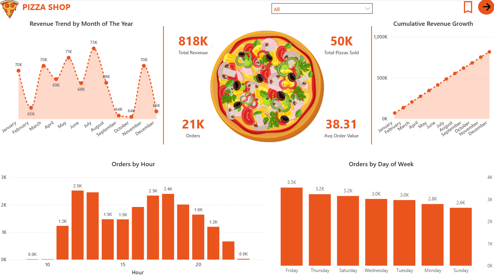

# 🍕 Pizza Sales Analysis Dashboard

An interactive Power BI dashboard built on a pizza sales dataset — exploring what actually drives the business: which pizzas sell, when people order, and where there's room to improve.

---

## 📌 About the Project

Started with SQL to explore the raw data — revenue, best-sellers, order timing. Then moved into Power BI to turn that into something visual and interactive.

Key questions answered:
- What's the total revenue and average order value?
- When are the busiest hours and days?
- Which pizzas/categories drive the most revenue?
- Which pizzas underperform and could be dropped?
- Do size preferences change by category?
- Are most orders small (1-2 pizzas) or bulk?

---

## 🛠️ Tools Used
Power BI · SQL · DAX

---

## 📂 Dataset
Pizza sales dataset with four related tables: Orders, Order Details, Pizzas, Pizza Types.

---

## ✨ Dashboard Pages

**📊 Sales Overview** — KPIs, revenue trend, rush hours, cumulative growth.

**🍕 Product Performance** — top/bottom sellers, category revenue share, top pizzas per category, highest-priced pizza vs average.

**📦 Order & Size Patterns** — size distribution, size preference by category, order size distribution (upsell insight).

---

## 📸 Dashboard Preview

---

## 🚀 What I Learned
SQL-based data exploration, Power BI data modeling, DAX (RANKX, cumulative measures, calculated tables), conditional formatting, and interactive navigation with bookmarks/buttons.

---

## 🔗 Related Project
SQL queries for this analysis are in a separate repo.
➡️ **Pizza Sales SQL Analysis** *[(link-to-your-sql-repo)](https://github.com/madhur489/Pizza-Sales-SQL-Analysis)*

---

## ⭐ Final Thoughts
A full workflow from raw SQL exploration to an interactive dashboard — finding the real insights and presenting them in a way a business could act on.
